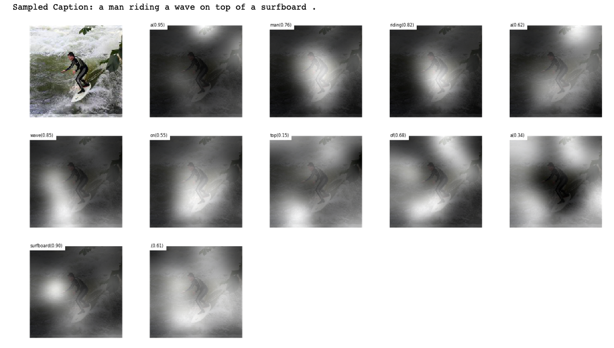
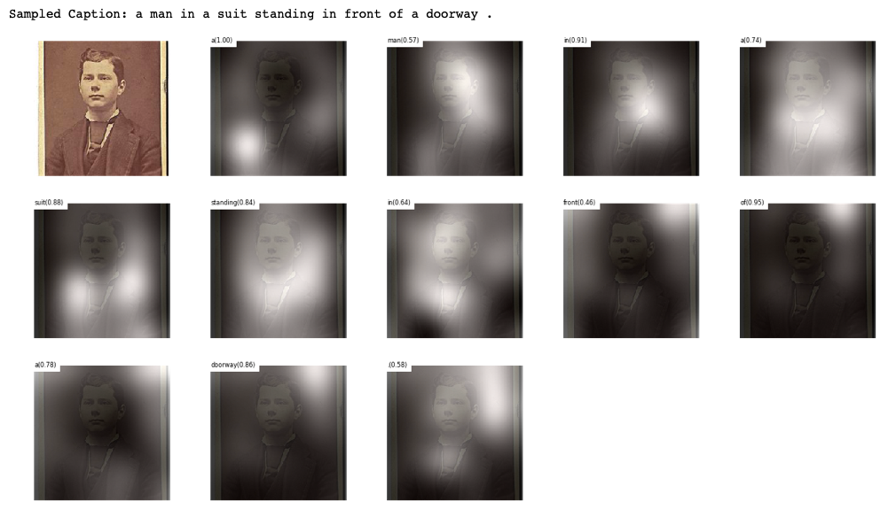

# Show, Attend and Tell - Neural Image Caption Generation with Visual Attention

## Project for ITEC876 (Applications of data science)

Link to report: https://github.com/sedhasukhdeep/show-attend-and-tell/blob/master/Report_Group%20M.pdf

Requirements to run the project:

(As successfully replicated): Link to instance available on request.

- AWS SAGEMAKER ml.m4.16x large instance (needs to be requested specially) [Colab, GCP does not work when tested]
- Conda 2.7 with tensorflow kernel
- 200GB storage attached to instance

# Step 1

Run all the cells in Model_train file

- Clones the required repos to working directory
- Dowloads MS COCO dataset
- Downloads VGG19 model
- Unzips and places the captions and images into subdirectories
- Resizes files to 224x224
- preprocesses the images and captions saves it to hickle
- training saves model after each epoch and prints the BLeU scores to stdoutput (Time taken >12hrs, ensure to keep AWS session alive, try any autoclicker) 

# Step 2

- LINK FOR MODELS TRAINED DURING REPLICATION: https://www.dropbox.com/s/nq7o5ynvs4etdsi/models.zip?dl=0
- Unzip these to /show-attend-and-tell-tensorflow/models/lstm/
- Copy the eval file from root to /show-attend-and-tell-tensorflow/
- Run all cells

## Evaluation

We have successfully replicated the research paper "Show, Attend and Tell - Neural Image Caption Generation with Visual Attention" and achieved following accuracy scores:

- BLEU-1 : 61.82%
- BLEU-2 : 40.05%
- BLEU-3 : 26.17%
- BLEU-4 : 17.49%
- METEOR : 19.93%

Here are the BLEU scores which we received after running the model in comparison to author's:

# Attention layers and gradient plot

# Batch-loss curve

